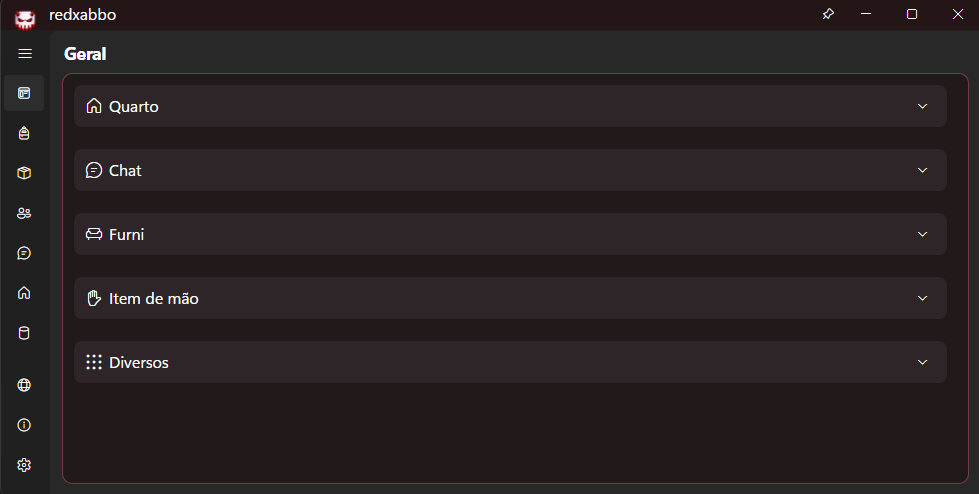

<p align="center">
  
</p>

<h1 align="center">redxabbo</h1>

<p align="center">
  Ferramenta para usar no G-Earth/Habbo.
</p>

<p align="center">
  
  
  
  
  
  
  <a href="LICENSE"></a>
</p>

<p align="center">
  <a href="https://github.com/turkosx/red-xabbo">
    
  </a>
  <a href="https://github.com/turkosx/red-xabbo/releases">
    
  </a>
  <a href="https://github.com/turkosx/red-xabbo/issues">
    
  </a>
</p>

---

## O que e o redxabbo
O `redxabbo` e uma extensao para uso com o `G-Earth` no Habbo.

O foco do projeto e facilitar tarefas do dia a dia, reduzir acoes repetitivas e dar mais visibilidade do que acontece no quarto e no chat.

---

## Recursos principais
- Ferramentas de quarto: moderacao, visualizacao de usuarios, furni e visitantes.
- Controles de chat: filtros, silenciar tipos de mensagem e alertas.
- Utilitarios de produtividade: busca de usuario em quartos, atalhos e automacoes.
- Interface em dois idiomas: `PT-BR` e `EN`.

---

## Requisitos
Para usar o `redxabbo`, voce precisa de:
1. `G-Earth` instalado e funcionando.
2. Habbo aberto pelo `G-Earth`.
3. `.NET 8 Runtime` instalado no sistema.

<p>
  <a href="https://dotnet.microsoft.com/en-us/download/dotnet/8.0">
    
  </a>
</p>

---

## Download
Baixe sempre pela pagina oficial de versoes:

<p>
  <a href="https://github.com/turkosx/red-xabbo/releases">
    
  </a>
</p>

### Arquivos da versao
- `red-xabbo.exe`: executavel para Windows (arquivo principal para usuario final).
- `red-xabbo-source.zip`: codigo-fonte em `.zip` (para desenvolvimento).
- `red-xabbo-source.tar.gz`: codigo-fonte em `.tar.gz` (para desenvolvimento).
- arquivos do GitHub chamados `Source code (zip)` e `Source code (tar.gz)`: gerados automaticamente em toda versao.

---

## Instalacao e uso (Windows)
1. Baixe o arquivo `red-xabbo.exe` na versao mais recente.
2. Abra o `G-Earth`.
3. Abra o Habbo pelo `G-Earth` e conecte em um quarto.
4. Execute `red-xabbo.exe`.
5. Use normalmente as abas da interface.

Se o Windows SmartScreen bloquear na primeira execucao, clique em "Mais informacoes" e depois em "Executar assim mesmo".

---

## Primeiro uso
Sugestao de configuracao inicial:
1. Abra a aba `Configuracoes`.
2. Defina o idioma da interface.
3. Revise as opcoes de chat, alertas e intervalos de operacao.

Abas mais usadas:
- `Geral`: ferramentas rapidas, anti-funcoes, chat e busca.
- `Quarto`: dados do quarto, usuarios, visitantes, banimentos e furni.
- `Chat`: monitoramento de mensagens e eventos.
- `Amigos`, `Inventario`, `Guarda-roupa`, `Navegador`, `Perfil`: utilitarios adicionais.
- `Configuracoes`: idioma e ajustes globais.

---

## Busca de usuario
Para buscar um usuario em quartos abertos:
1. Abra `Geral > Buscar`.
2. Digite o nome do usuario.
3. Clique em `Buscar`.
4. Acompanhe o campo `Status`.
5. Clique em `Parar` para interromper.

Quando o usuario e encontrado, a extensao informa o quarto correspondente.

---

## Solucao de problemas
### O redxabbo nao abre
- Verifique se o `.NET 8 Runtime` esta instalado.
- Tente executar o `red-xabbo.exe` como administrador.
- Feche e abra o `G-Earth` novamente.

### O redxabbo abre, mas nao conecta
- Confirme que o Habbo foi iniciado pelo `G-Earth`.
- Confira se o `G-Earth` esta conectado e interceptando normalmente.
- Feche e abra novamente o Habbo e depois o redxabbo.

### A busca nao encontra o usuario
- O usuario pode nao estar em quarto aberto/publico naquele momento.
- Aguarde alguns segundos e tente novamente.
- Confira se o nome foi digitado exatamente igual ao do Habbo.

### Quero restaurar configuracoes
Os arquivos locais ficam em `%APPDATA%\\xabbo\\`:
- `config.json`
- `wardrobe.json`
- `passwords.json`

Feche o app antes de editar ou remover esses arquivos.

---

## Privacidade
Se a opcao de lembrar senhas de quarto estiver ativa, as senhas sao salvas localmente em `%APPDATA%\\xabbo\\passwords.json` em texto simples.

Use essa opcao apenas em computador confiavel.

---

## Creditos e referencias
Essa build se apoia no ecossistema xabbo e em contribuicoes da comunidade.

<p align="center">
  <a href="https://xabbo.io">
    
  </a>
  <a href="https://github.com/b7c">
    
  </a>
  <a href="https://github.com/QDaves">
    
  </a>
  <a href="https://github.com/xabbo/xabbo/forks">
    
  </a>
  <a href="https://discord.gg/JRxbfhuc3T">
    
  </a>
</p>

| Fonte | Papel no projeto |
| :-- | :-- |
| [Xabbo APIs](https://xabbo.io) | APIs e referencias tecnicas usadas como base. |
| [Xabbo Forks](https://github.com/xabbo/xabbo/forks) | Forks e projetos derivados do repositorio principal. |
| [b7c](https://github.com/b7c) | Credito principal pela stack Xabbo. |
| [QDaves](https://github.com/QDaves) | Contribuicoes e apoio da comunidade. |
| [Discord Community](https://discord.gg/JRxbfhuc3T) | Espaco para suporte, novidades e troca de conhecimento. |

---

## Suporte
Para duvidas, sugestoes ou bugs:
- Repositorio: `https://github.com/turkosx/red-xabbo`
- Suporte tecnico (Issues): `https://github.com/turkosx/red-xabbo/issues`
- Discord da comunidade: `https://discord.gg/JRxbfhuc3T`

---

## Para desenvolvimento (opcional)
Se voce quer compilar o projeto localmente:

```bash
git clone --recurse-submodules https://github.com/turkosx/red-xabbo.git
cd red-xabbo
dotnet restore
dotnet run --project src/Xabbo.Avalonia
```

---

## Licenca
Este projeto usa a licenca MIT.
Consulte o arquivo `LICENSE`.
